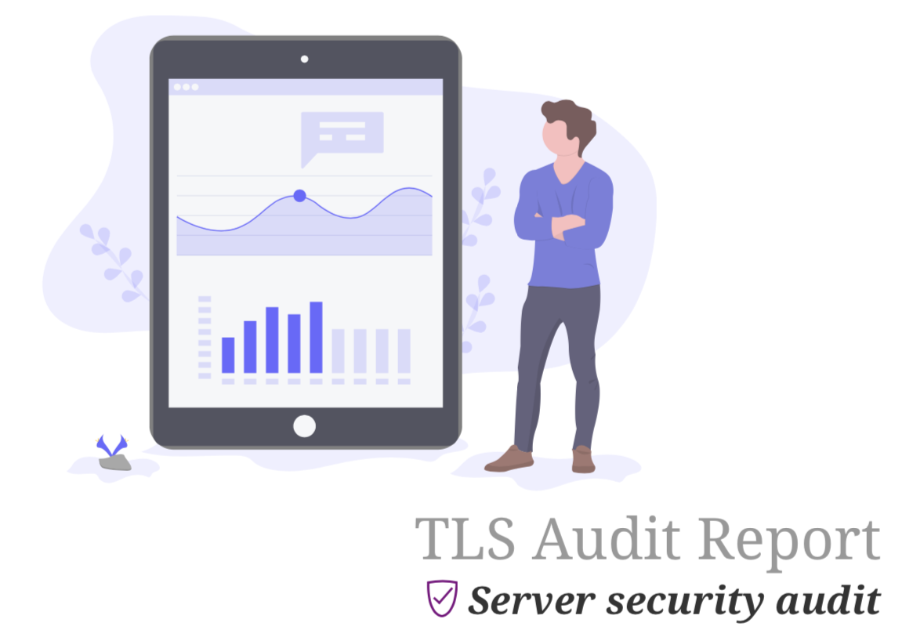

[](https://travis-ci.org/adedayo/tlsaudit)
[](https://goreportcard.com/report/github.com/adedayo/tlsaudit)

[](https://github.com/adedayo/tlsaudit/blob/master/LICENSE)

# TLS Audit 
TLS Audit is a *fast* utility for auditing TLS (including SSL and STARTTLS) security settings. You can use it to enumerate protocols, ciphers and curves supported by an open TCP port.

* It combines port scanning with TLS Audits (skip port scanning with explicit port ranges)
* Supports auditing of STARTTLS servers, e.g. email servers
* Unlike excellent tools like SSL Labs server test, you can use TLS Audit to scan servers internal to your network that are not exposed to the public Internet - Scan your server before exposing them: avoid "testing in production"!
* Scan entire CIDR ranges with TLS Audit to discover which ports are open and get details of the TLS configurations of the open ports.
* Supports bulk scanning of your servers natively 
* You can scan specific port ranges within CIDR ranges too, by using a format such as `tlsaudit 10.10.5.0:443/24`, which scans the entire CIDR range `10.10.5.0/24` but looking only at port `443`. 
  * When port ranges are specified, the initial port scanning step is skipped and only the explicitly specified port ranges are examined for SSL/STARTTLS/TLS configuration
* Generate nice-looking reports for your audit and compliance efforts with the PDF reporting feature




## Using it as a command-line tool
TLSAudit is also available as a command-line tool. 

### Installation
Prebuilt binaries may be found for your operating system here: https://github.com/adedayo/tlsaudit/releases

For macOS X, you could install via brew as follows:
```bash
brew tap adedayo/tap
brew install tlsaudit
``` 

### Scanning CIDR ranges

```bash
tlsaudit 8.8.8.8 192.168.2.5/30 10.11.12.13:443/31
```

For JSON-formatted output simply add the `--json` or `-j` flag:

```bash
tlsaudit --json 8.8.8.8 192.168.2.5/30 10.11.12.13:443/31
```
Depending on the fidelity of the network being scanned or the size of CIDR ranges, it may be expedient to adjust the scan timeout and the number of packets per second to send during the open port discovery phase. Several scanning options are available. See the options from the commandline help.

### Generating pretty PDF reports

TLSAudit can now generate PDF reports of your scan to share with auditors or whoever may be interested in details of your server configuration.
Use the `--report` command-line flag or the shorthand `-r`

```bash
tlsaudit --report ecc384.badssl.com:443
```

This generates a report similar to the following: [ecc384.badssl.com.pdf](ecc384.badssl.com.pdf)

_Note that reporting requires that asciidoctor-pdf, which is used to generate the report, is installed on your machine._ Details of obtaining the free tool is here: [Asciidoctor PDF documentation](https://asciidoctor.org/docs/asciidoctor-pdf/)

### Command line options

```bash
Usage:
  tlsaudit [flags]

Examples:
tlsaudit 8.8.8.8/32 10.10.10.1/30
tlsaudit --timeout=10 8.8.8.8:443/32

Flags:
      --api int                                             run as an API service on the specified port (default 12345)
  -h, --help                                                help for tlsaudit
  -c, --hide-certs                                          suppress certificate information in output (default: false)
      --hide-no-tls                                         suppress the display of ports with no TLS support in output. Note that non-open ports will be shown as not supporting TLS when ports are explicitly specified in the host to audit, bypassing host port scan, which makes this flag particularly useful (default: false)
  -i, --input string[="tlsaudit_input.txt"]                 read the CIDR range, IPs and domains to scan from an input FILE separated by commas, or newlines (default "tlsaudit_input.txt")
  -j, --json                                                generate JSON output
  -o, --output string[="tlsaudit.txt"]                      write results into an output FILE (default "tlsaudit.txt")
  -p, --protocols-only                                      only check supported protocols - will not do detailed checks on supported ciphers (default: false)
  -q, --quiet                                               control whether to produce a running commentary of progress or stay quiet till the end (default: false)
      --rate int                                            the rate (in packets per second) that we should use to scan for open ports (default 1000)
  -r, --report                                              generate a PDF report of the scan. Requires asciidoctor-pdf installed (default: false)
  -s, --service string[="data/config/TLSAuditConfig.yml"]   run tlsaudit as a service (default "data/config/TLSAuditConfig.yml")
  -m, --show-cipher-metrics                                 enumerate all ciphers and show associated security and performance metrics (default: false)
  -t, --timeout int                                         TIMEOUT (in seconds) to adjust how much we are willing to wait for servers to come back with responses. Smaller timeout sacrifices accuracy for speed (default 5)
      --version                                             version for tlsaudit                                          version for tlsaudit
```

## An issue on macOS
You may encounter errors such as 
```bash
panic: en0: You don't have permission to capture on that device ((cannot open BPF device) /dev/bpf0: Permission denied)
```
Fix the permission problem permanently by using the "Wireshark" approach of pre-allocating _/dev/bpf*_, and changing their permissions so that the _admin_ group can read from and write packets to the devices. I have provided the _fix-bpf-permissions.sh_ script to simplify the steps, you can run it as shown below. It will ask for your password for the privileged part of the script, but read the script to satisfy yourself that you trust what it is doing! You care about security, right?

```bash
curl -O https://raw.githubusercontent.com/adedayo/tlsaudit/master/fix-bpf-permissions.sh
chmod +x fix-bpf-permissions.sh
./fix-bpf-permissions.sh  
```

You should be good to go! You may need to reboot once, but this works across reboots. Note that this is a common problem for tools such as Wireshark, TCPDump etc. that need to read from or write to /dev/bpf*. This solution should fix the problem for all of them - the idea was actually stolen from Wireshark with some modifications :-).

## Running as non-root on Linux
You ideally want to be able to run `tlsaudit` as an ordinary user, say, `my_user`, but since `tlsaudit` sends raw packets you need to adjust capabilities to allow it to do so. The following may be necessary:

Ensure the following two lines are in _/etc/security/capability.conf_
```bash
cap_net_admin   my_user
none *
```

Also, in _/etc/pam.d/login_ add the following 
```bash
auth    required        pam_cap.so
```

Finally, grant the capability to the `tlsaudit` file (assuming _/path/to_ is the absolute path to your `tlsaudit` binary)
```bash
setcap cap_net_raw,cap_net_admin=eip /path/to/tlsaudit
```
## License
BSD 3-Clause License